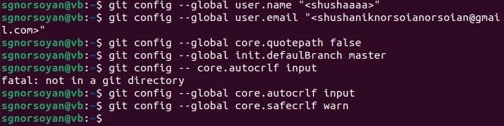
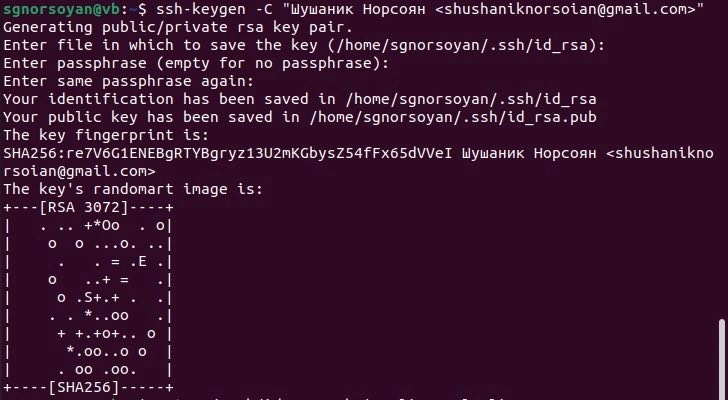
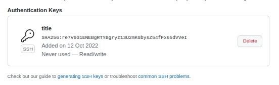
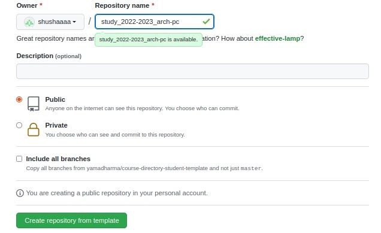
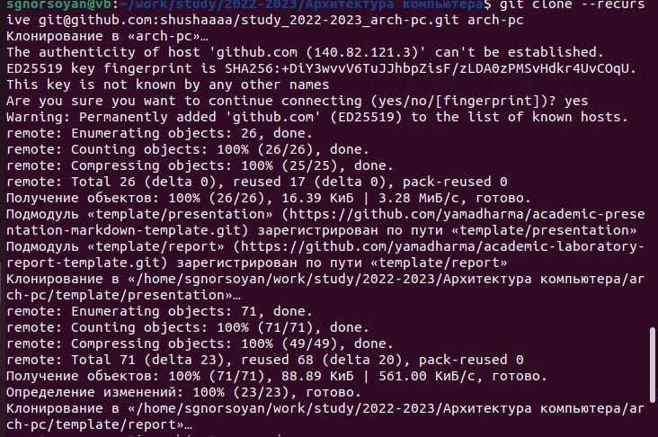
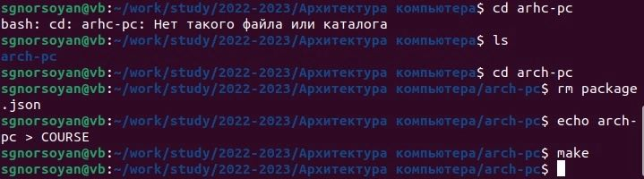
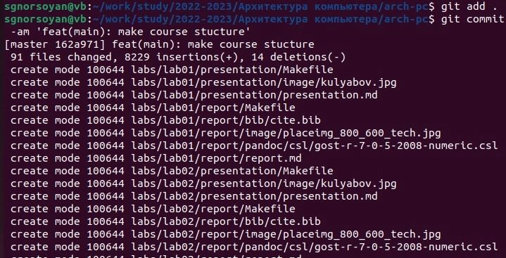
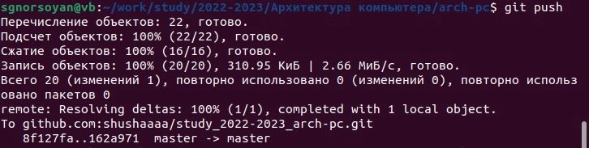
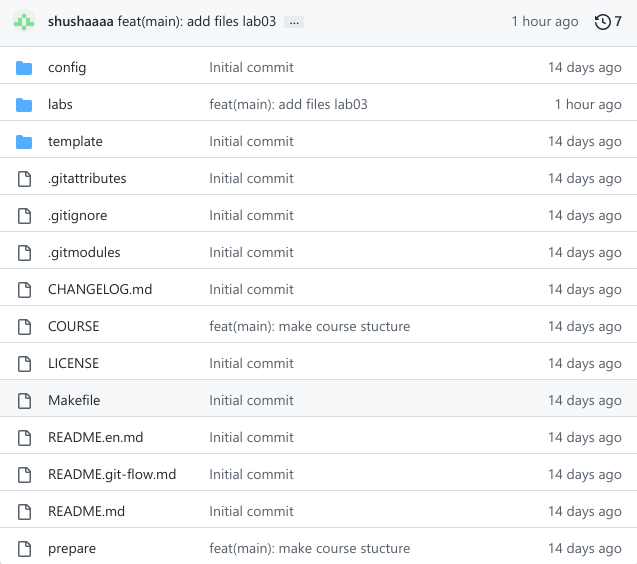

---
## Front matter
title: "Лабораторная работа №2"
subtitle: "Архитектура вычислительных машин "
author: "Норсоян Шушаник Гагиковна"

## Generic otions
lang: ru-RU
toc-title: "Содержание"

## Bibliography
bibliography: bib/cite.bib
csl: pandoc/csl/gost-r-7-0-5-2008-numeric.csl

## Pdf output format
toc: true # Table of contents
toc-depth: 2
lof: true # List of figures
lot: true # List of tables
fontsize: 12pt
linestretch: 1.5
papersize: a4
documentclass: scrreprt
## I18n polyglossia
polyglossia-lang:
  name: russian
  options:
	- spelling=modern
	- babelshorthands=true
polyglossia-otherlangs:
  name: english
## I18n babel
babel-lang: russian
babel-otherlangs: english
## Fonts
mainfont: PT Serif
romanfont: PT Serif
sansfont: PT Sans
monofont: PT Mono
mainfontoptions: Ligatures=TeX
romanfontoptions: Ligatures=TeX
sansfontoptions: Ligatures=TeX,Scale=MatchLowercase
monofontoptions: Scale=MatchLowercase,Scale=0.9
## Biblatex
biblatex: true
biblio-style: "gost-numeric"
biblatexoptions:
  - parentracker=true
  - backend=biber
  - hyperref=auto
  - language=auto
  - autolang=other*
  - citestyle=gost-numeric
## Pandoc-crossref LaTeX customization
figureTitle: "Рис."
tableTitle: "Таблица"
listingTitle: "Листинг"
lofTitle: "Список иллюстраций"
lotTitle: "Список таблиц"
lolTitle: "Листинги"
## Misc options
indent: true
header-includes:
  - \usepackage{indentfirst}
  - \usepackage{float} # keep figures where there are in the text
  - \floatplacement{figure}{H} # keep figures where there are in the text
---

# Цель работы

 Целью работы является изучить идеологию и применение средств контроля
версий. Приобрести практические навыки по работе с системой git
 
# Задание

1.Создайте отчет по выполнению лабораторной работы в соответствующем
каталоге рабочего пространства (labs>lab03>report).

2.Скопируйте отчеты по выполнению предыдущих лабораторных работ в соответствующие каталоги созданного рабочего пространства.

3.Загрузите файлы на github

# Теоретическое введение
# Выполнение лабораторной работы

1)Сначала сделаем предварительную конфигурацию git. 
Откроем терминал и введем следующие команды, указав свое имя и email:

2)Настроим utf-8 в выводе сообщений git:

3)Зададим имя начальной ветки (будем называть её master):

4)Параметр autocrlf:

5)Параметр safecrlf:

Эти действия показаны на рисунке 

{#fig:002 width=90%}

6) Сгенерируем пару ключей как на рисунке 

{#fig:003 width=90%}

{#fig:004 width=90%}

7)Далее необходимо загрузить сгенерённый открытый ключ.Зайдем на сайт http://github.org. Скопируем из локальной консоли ключ в буфер обмена.

{#fig:005 width=90%}

8)Создадим каталог для предмета «Архитектура компьютера»

{#fig:006 width=90%}

9)Перейдем на станицу репозитория с шаблоном курса. В открывшемся окне задаем имя репозитория

{ #fig:007 width=90% }

10)Откроем терминал и перейдем в каталог курса:

{ #fig:008 width=90% }

11)Клонируем созданный репозиторий:

{ #fig:009 width=90% }

12)Перейдем в каталог курса

13)Удалим лишние файлы:

14)Создадим необходимые каталоги:

Эти действия показаны на рисунке 

{ #fig:0010 width=90% }

15)Отправим файлы на сервер.

{ #fig:0011 width=90% }

{ #fig:0012 width=90% }

16)Проверим правильность создания иерархии рабочего пространства в локальном репозитории и на  странице github

{#fig:0013 width=90%}

# Выводы

В ходе выполнения лабораторной работы я изучила идеологию и
применение средств контроля версий, у меня появились практические навыки
по работе с системой git и платформой github.

# Список литературы{.unnumbered}

::: {#refs}
:::
