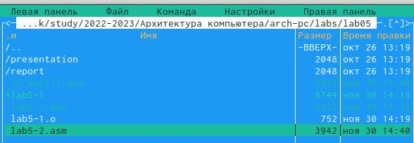
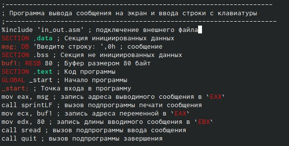
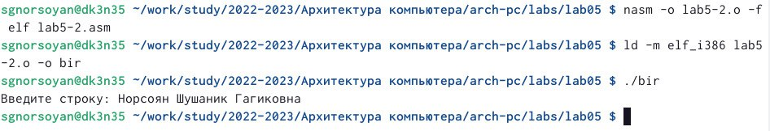
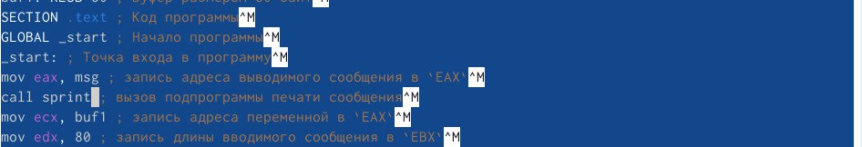
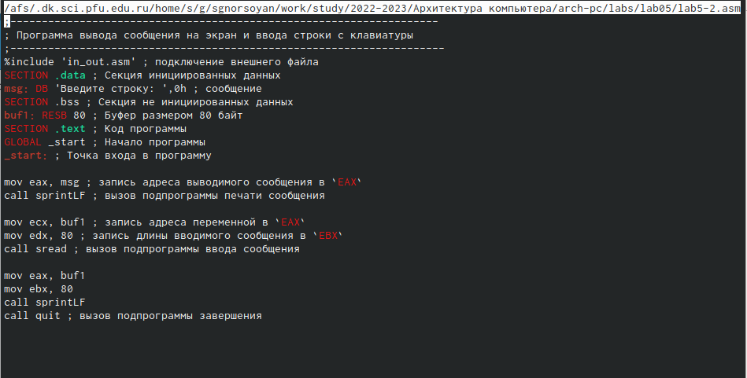
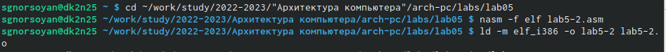
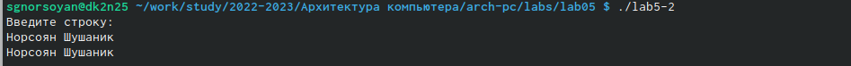
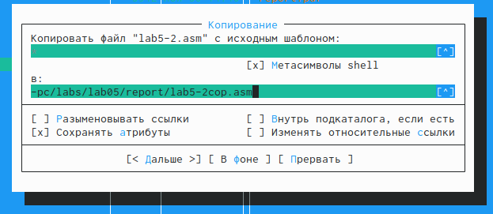
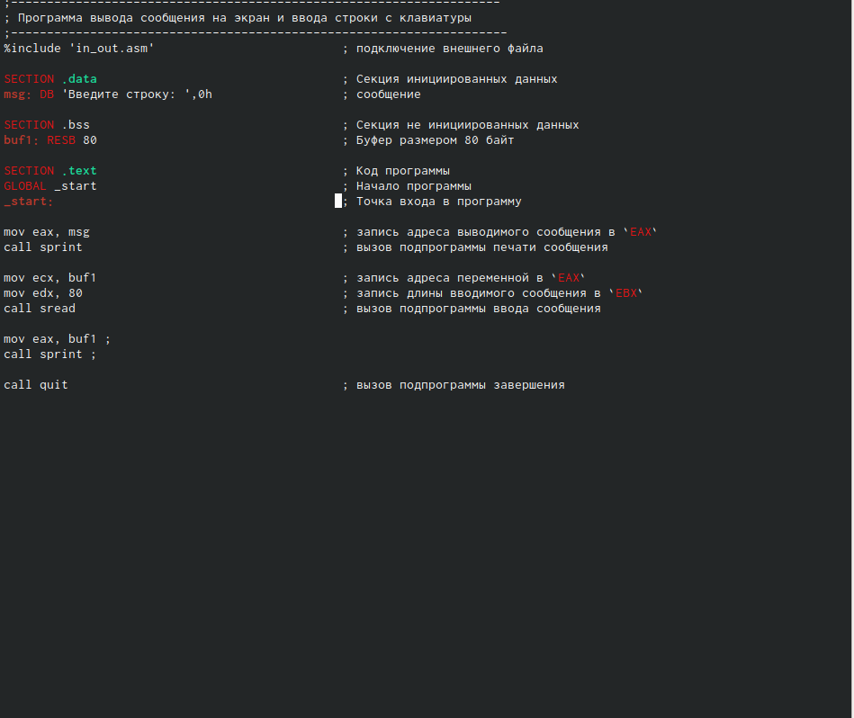

---
## Front matter
title: "Архитектура вычислительных машин"
subtitle: "Лабораторная работа N5"
author: "Норсоян Шушаник Гагиковна"

## Generic otions
lang: ru-RU
toc-title: "Содержание"

## Bibliography
bibliography: bib/cite.bib
csl: pandoc/csl/gost-r-7-0-5-2008-numeric.csl

## Pdf output format
toc: true # Table of contents
toc-depth: 2
lof: true # List of figures
lot: true # List of tables
fontsize: 12pt
linestretch: 1.5
papersize: a4
documentclass: scrreprt
## I18n polyglossia
polyglossia-lang:
  name: russian
  options:
	- spelling=modern
	- babelshorthands=true
polyglossia-otherlangs:
  name: english
## I18n babel
babel-lang: russian
babel-otherlangs: english
## Fonts
mainfont: PT Serif
romanfont: PT Serif
sansfont: PT Sans
monofont: PT Mono
mainfontoptions: Ligatures=TeX
romanfontoptions: Ligatures=TeX
sansfontoptions: Ligatures=TeX,Scale=MatchLowercase
monofontoptions: Scale=MatchLowercase,Scale=0.9
## Biblatex
biblatex: true
biblio-style: "gost-numeric"
biblatexoptions:
  - parentracker=true
  - backend=biber
  - hyperref=auto
  - language=auto
  - autolang=other*
  - citestyle=gost-numeric
## Pandoc-crossref LaTeX customization
figureTitle: "Рис."
tableTitle: "Таблица"
listingTitle: "Листинг"
lofTitle: "Список иллюстраций"
lotTitle: "Список таблиц"
lolTitle: "Листинги"
## Misc options
indent: true
header-includes:
  - \usepackage{indentfirst}
  - \usepackage{float} # keep figures where there are in the text
  - \floatplacement{figure}{H} # keep figures where there are in the text
---

# Цель работы

Приобретение практических навыков работы в Midnight Commander. Освоение
инструкций языка ассемблера mov и int.

# Задание
1.Создайте копию файла lab5-1.asm. Внесите изменения в программу (без использования внешнего файла in_out.asm), так чтобы она работала по следующему алгоритму

2.Получите исполняемый файл и проверьте его работу. На приглашение ввести строку введите свою фамилию.

3.Создайте копию файла lab5-2.asm. Исправьте текст программы с использование подпрограмм из внешнего файла in_out.asm, так чтобы она работала по следующему алгоритму:
• вывести приглашение типа “Введите строку:”;
• ввести строку с клавиатуры;
• вывести введённую строку на экран.

4.Создайте исполняемый файл и проверьте его работу.

# Выполнение лабораторной работы

1.Открою Midnight Commander

2.Перейду в каталог, созданный при выполнении лабораторной работы N5 

3.С помощью функциональной клавиши создам папку lab5

4.Пользуясь строкой ввода и спецтальной командой создам файл lab5

5.С помощью функциональной клавиши открою файл lab5 для редактирования во встроенном редакторе.

{ #fig:002 width=90% }

6.Введу текст программы из листинга, сохраню изменения и закройю файл.

7.С помощью функциональной клавиши открою файл lab5 для просмотра. Убежусь, что файл содержит текст программы

{ #fig:003 width=90% } 

8.Оттранслирую текст программы lab5 в объектный файл. Выполню компоновку объектного файла и запущу получившийся исполняемый файл.

{ #fig:004 width=90% } 

9.Скачаю файл in_out.asm со страницы курса в ТУИС.

10.Скопирую файл in_out.asm в каталог с файлом lab5-1.asm с помощью функциональной клавиши

11.С помощью функциональной клавиши создам копию файла lab5-1.asm с именем lab5-2.asm.

12.Исправлю текст программы в файле lab5-2.asm с использование подпрограмм из внешнего файла in_out.asm 

13.В файле lab6-2.asm заменю подпрограмму sprintLF на sprint. Создам исполняемый файл и проверю его работу.

{ #fig:005 width=90% } 

{ #fig:006 width=90% } 

{ #fig:007 width=90% } 

sprint – выводит информацию на экран
sprintLF - аналогичная команда, только он добавляет символ перевода строки

# Задание для самостоятельной работы

1.Создам копию файла lab5-1.asm с именем lab5-2.asm

{ #fig:008 width=90% } 

2.Получаем исполняемый файл и исправляем текст программы и проверим его работу. На приглашение ввести строку вводим свою фамилию

{ #fig:009 width=90% }

{ #fig:010 width=90% }
 
{ #fig:011 width=90% }
 
3.Создам копию файла lab5-2.asm.

{ #fig:012 width=90% }

4.Исправляем текст программы

{ #fig:013 width=90% }

# Выводы

Я приобрела практические навыки работы в Midnight commander.Освоели инструкции языка ассемблера mov и int.

# Список литературы{.unnumbered}

::: {#refs}
:::
