---
## Front matter
title: "Архитектура вычислительных машин"
subtitle: "Лабораторная работа N6"
author: "Норсоян Шушаник Гагиковна"

## Generic otions
lang: ru-RU
toc-title: "Содержание"

## Bibliography
bibliography: bib/cite.bib
csl: pandoc/csl/gost-r-7-0-5-2008-numeric.csl

## Pdf output format
toc: true # Table of contents
toc-depth: 2
lof: true # List of figures
lot: true # List of tables
fontsize: 12pt
linestretch: 1.5
papersize: a4
documentclass: scrreprt
## I18n polyglossia
polyglossia-lang:
  name: russian
  options:
	- spelling=modern
	- babelshorthands=true
polyglossia-otherlangs:
  name: english
## I18n babel
babel-lang: russian
babel-otherlangs: english
## Fonts
mainfont: PT Serif
romanfont: PT Serif
sansfont: PT Sans
monofont: PT Mono
mainfontoptions: Ligatures=TeX
romanfontoptions: Ligatures=TeX
sansfontoptions: Ligatures=TeX,Scale=MatchLowercase
monofontoptions: Scale=MatchLowercase,Scale=0.9
## Biblatex
biblatex: true
biblio-style: "gost-numeric"
biblatexoptions:
  - parentracker=true
  - backend=biber
  - hyperref=auto
  - language=auto
  - autolang=other*
  - citestyle=gost-numeric
## Pandoc-crossref LaTeX customization
figureTitle: "Рис."
tableTitle: "Таблица"
listingTitle: "Листинг"
lofTitle: "Список иллюстраций"
lotTitle: "Список таблиц"
lolTitle: "Листинги"
## Misc options
indent: true
header-includes:
  - \usepackage{indentfirst}
  - \usepackage{float} # keep figures where there are in the text
  - \floatplacement{figure}{H} # keep figures where there are in the text
---

# Цель работы

Освоение арифметических инструкций языка ассемблера NASM.

# Задание

1. Написать программу вычисления выражения 𝑦 = 𝑓(𝑥). Программа должна
выводить выражение для вычисления, выводить запрос на ввод значения
𝑥, вычислять заданное выражение в зависимости от введенного 𝑥, выво-
дить результат вычислений. Вид функции 𝑓(𝑥) выбрать из таблицы 6.3
вариантов заданий в соответствии с номером полученным при выполне-
нии лабораторной работы. 
2. Создайте исполняемый файл и проверьте его
работу для значений 𝑥1 и 𝑥2 из 6.3.

# Теоретическое введение

# Выполнение лабораторной работы

1. Создайте каталог для программам лабораторной работы No 7, перейдите в
него и создайте файл lab7-1.asm:

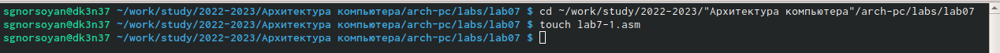{ #fig:002 width=90% } 

2. Рассмотрим примеры программ вывода символьных и численных значе-
ний. Программы будут выводить значения записанные в регистр eax.

3. Создаем исполняемый файл и запускаем его.

4. Изменяем текст программы lab7-1.asm, создаем исполняемый файл и запускаем его

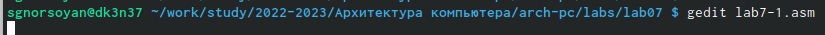{ #fig:003 width=90% }

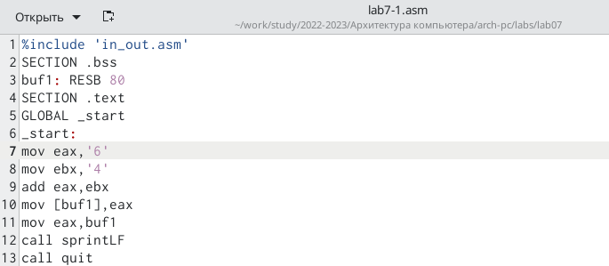{ #fig:004 width=90% }

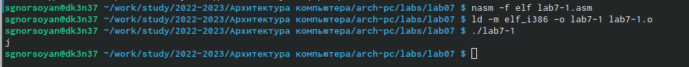{ #fig:005 width=90% }

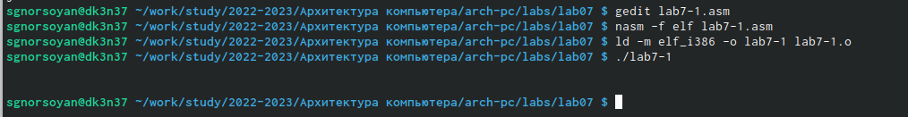{ #fig:006 width=90% }

5. Создаем файл lab7-2.asm и вводим в него текст программы из листинга 7.2 , создаем исполняемый файл и запускаем его.

6. Изменяем строки mov eax,'6' и mov ebx,'4' на строки mov eax,6 mov ebx,4

7. Заменяем функцию iprintLf на iprint

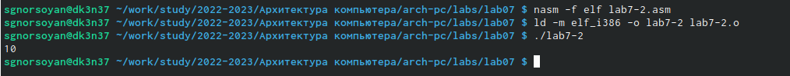{ #fig:007 width=90% }

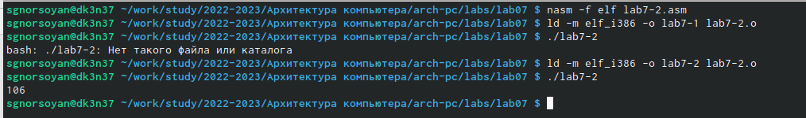{ #fig:008 width=90% }

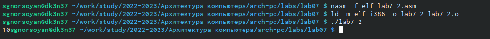{ #fig:009 width=90% }

8. Создаем файл lab7-3.asm в каталоге ~/work/arch-pc/lab06

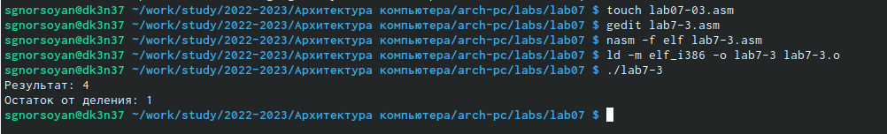{ #fig:010 width=90% }

9. Редактируем файл lab7-3.asm с помощью листинга, создаем исполняемый файл и запускаем его

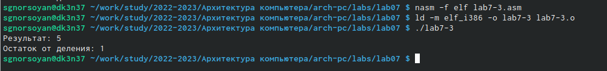{ #fig:011 width=90% }

10. Изменяем текст программы для вычисления f(x) = (4*6+2)/5, создаем исполняемый файл и проверяем его работу.

11. Создаем файл variant.asm в каталоге ~/work/arch-pc/lab06

12. Редактируем файл variant.asm с помощью листинга 7.4, создаем исполняемый файл и запускаем его.

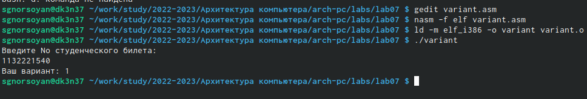{ #fig:012 width=90% }

# Самостоятельная работа Вариант 2

1. Внесу изменения в файл lab7-4 чтобы он вычислил корни х1 и х2 

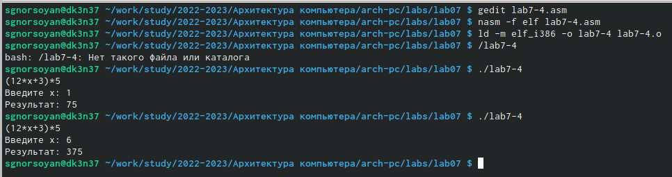{ #fig:013 width=90% }

# Ответы на вопросы

1. mov eax, rem all sprint

2. mov ecx,x - запись входной переменной в регист ecx
   mov edx, 80 - запись размера переменной в регистр edx
   call spread - вызов процедуры чтения данных

3. Функция преобразующая, ascii-код символа в целое число и записывающая результат в регистр eax

4. xor edx,edx mov ebx, 20 div ebx inc edx

5. ebx

6. Инструкция inc используется для увеличения операнда на единицу

7. mov eax,rem call sprint mov eax,edx call iprintLF

# Выводы

В ходе выполнения лабораторной работы я овоила арифметические инструкции языка ассемблера NASM.

# Список литературы{.unnumbered}

::: {#refs}
:::
